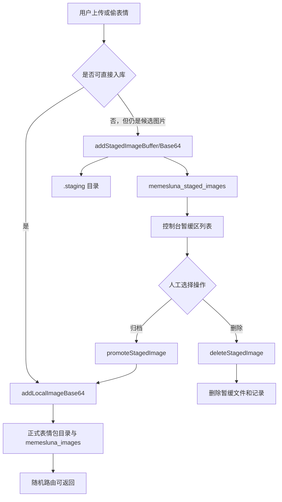

# MemesLuna 暂缓区功能与过滤图片保存逻辑分析报告

生成时间：2026-06-04
项目路径：F:\Lumia\Desktop\work\koishi-plugin-memesluna

## 1. 结论

本次新增了一个独立的“暂缓区”链路，用于保存被过滤器拦截、但仍值得人工复核的图片。暂缓图片不会进入正式表情包分组，也不会参与随机图片路由；只有用户在控制台手动选择目标表情包并点击归档后，图片才会通过现有入库逻辑写入对应分组。

暂缓区采用单独的数据库表 `memesluna_staged_images` 与单独的本地目录 `.staging`。这相当于 GitHub 暂存区/审核区：先保留候选，再由用户决定是否归档、丢弃或转码后处理。

## 2. 原有过滤逻辑

### 2.1 Web 控制台上传过滤

位置：`client/Dashboard.vue:1729`

上传入口 `uploadFiles(files)` 会读取用户拖拽或选择的图片文件。原逻辑会直接拒绝：

- `.avif` 文件：提示 QQ 机器人框架无法渲染及读取。
- 大于 10MB 的文件：提示超过单个图片素材限制。
- 非图片文件：提示无效图片格式。
- 单次超过 50 张：提示分批导入。

本次改造后，超过 10MB 的兼容图片会调用 `stageFilteredFiles()` 写入暂缓区；AVIF 仍直接拦截提示，不保存到暂缓区。其它合格图片继续上传到当前表情包。

### 2.2 命令偷表情过滤

位置：`src/index.ts:794`

`memesluna.stole <name>` / “偷了 [表情包名称]” 会下载引用消息中的图片，通过 `getExtFromMagicBytes()` 识别 JPG/PNG/GIF/WEBP/BMP。无法识别或不兼容的图片会直接返回失败；AVIF 不保存到暂缓区。

## 3. 后端暂缓区数据模型

### 3.1 类型与数据库表

位置：`src/service.ts:83`, `src/service.ts:199`, `src/service.ts:1214`

新增 `StagedImageInfo`：

- `id`：暂缓图片唯一 ID。
- `filename`：暂缓区实际保存文件名。
- `originalName`：原始文件名。
- `source`：来源，例如 `upload:<collection>` 或 `stole:<collection>`。
- `reason`：进入暂缓区的原因。
- `mime`：图片 MIME。
- `size`：文件大小。
- `createdAt`：创建时间。

新增数据库表 `memesluna_staged_images`：

- 主键：`id`
- 唯一约束：`filename`
- 记录图片元数据，不混入正式表情包的 `memesluna_images` 表。

### 3.2 本地存储目录

位置：`src/service.ts:221`, `src/service.ts:330`

暂缓区文件保存到：

```text
<storageRoot>/.staging
```

`ensureStorage()` 会自动创建 `.staging` 目录。因为它独立于各个表情包目录，所以暂缓图不会被 `getCollections()` 识别为一个表情包集合，也不会被随机路由使用。

### 3.3 暂缓区格式边界

位置：`src/service.ts:20`, `src/service.ts:454`, `src/service.ts:663`

正式表情包和暂缓区都沿用 `IMAGE_EXTENSIONS`。AVIF 不进入暂缓区，也不能直接归档进正式表情包；需要用户先转码为 JPG/PNG/GIF/WEBP 等兼容格式后再上传。

位置：`src/service.ts:840`

`promoteStagedImage()` 复用正式入库逻辑。由于暂缓区本身不再接收 AVIF，前端也不再提供 AVIF 暂缓项的转码提示或归档禁用分支。

## 4. 后端服务方法

位置：`src/service.ts:749`

### `addStagedImageBuffer(buffer, originalName, source, reason)`

将二进制图片写入 `.staging`，生成唯一文件名，并写入 `memesluna_staged_images` 表。

### `addStagedImageBase64(base64Data, originalName, source, reason)`

给 Console/HTTP 使用的 base64 入口，解析 data URL 或纯 base64 后调用 buffer 版本。

### `getStagedImages()`

读取暂缓表并按创建时间倒序返回。

### `getStagedImageBuffer(id)`

用于预览暂缓图片，按 ID 查表后读取 `.staging` 文件。

### `deleteStagedImage(id)`

删除暂缓文件和数据库记录。

### `promoteStagedImage(id, collectionName)`

人工归档：

1. 校验目标表情包存在。
2. 读取暂缓文件。
3. 校验格式适合正式表情包。
4. 调用现有 `addLocalImageBase64(collectionName, base64, originalName)` 入库。
5. 删除暂缓文件和暂缓记录。

关键点：归档复用现有正式入库逻辑，所以文件会按原有规则重命名为数字序号，如 `12.png`。

## 5. 后端接口

位置：`src/index.ts:234`, `src/index.ts:321`, `src/index.ts:428`

### Console RPC

- `memesluna/getState`：返回 `stagedImages`。
- `memesluna/getStagedImages`：刷新暂缓区列表。
- `memesluna/addStagedImage`：写入暂缓图片。
- `memesluna/deleteStagedImage`：删除暂缓图片。
- `memesluna/promoteStagedImage`：归档到指定表情包。
- `/api/admin/state`：也返回 `stagedImages`，保持 HTTP 管理状态与 Console 状态一致。

### HTTP API

- `GET <backendPath>/api/admin/staged-images/:id`
  - 用于控制台图片预览。
  - 返回图片二进制和对应 `Content-Type`。

- `POST <backendPath>/api/admin/staged-images`
  - 请求体：`{ base64, originalName?, source?, reason? }`
  - 用于外部或前端写入暂缓区。

## 6. 前端暂缓区页面

位置：`client/Dashboard.vue:723`

新增顶部标签“暂缓区”，与“表情包管理 / 分发管理 / 预览”同级。页面功能包括：

- 显示暂缓候选数量。
- 搜索文件名、来源、原因。
- 预览暂缓图片。
- 显示原始文件名、格式、原因、来源、大小、日期。
- 选择目标表情包。
- 点击“归档到表情包”。
- 点击“删除”。

相关前端状态和方法：

- `StagedImageInfo`：`client/Dashboard.vue:951`
- `stagedImages` / `stagingSearch` / `stagingTargetCollection` / `stagingBusyId`：`client/Dashboard.vue:995`
- `filteredStagedImages`：`client/Dashboard.vue:1193`
- `switchMainMenu()`：`client/Dashboard.vue:1231`
- `getStagedImageUrl()`：`client/Dashboard.vue:1257`
- `formatSize()`：`client/Dashboard.vue:1279`

- `refreshStagedImages()`：`client/Dashboard.vue:1394`
- `promoteStagedImage()`：`client/Dashboard.vue:1403`
- `deleteStagedImage()`：`client/Dashboard.vue:1435`
- `stageFilteredFiles()`：`client/Dashboard.vue:1456`
- 上传过滤入口：`client/Dashboard.vue:1729`
- 暂缓区样式：`client/Dashboard.vue:3722`

## 7. 当前数据流



## 8. 高频图片是否会自动保存到本地

历史说明：本报告生成于 2026-06-04，当时尚未发现“按出现频次自动保存高频图片”的逻辑。已有自动保存主要来自两个明确入口：

1. 控制台上传到某个表情包。
2. 命令偷表情并指定目标表情包。

截至 2026-07-07，项目已新增 `autoCollect` 自动暂存链路：插件可监听群聊图片，按图片哈希在指定时间窗口内累计出现次数，达到阈值后写入暂缓区等待人工复核。自动收集仍不会直接进入正式表情包，也不会参与随机图片路由；只有用户在 Console 暂缓区手动归档后，图片才会成为正式表情包素材。

后续追踪见 `docs/semantic-search-simplification-plan.md` 的 2026-07-07 follow-up 记录。

## 9. 验证结果

已运行：

```bash
npm run typecheck
npx yakumo build
```

结果：两项均通过。`yakumo build` 仅提示 Vite CJS Node API deprecation warning，不影响构建结果。

## 10. 注意事项

- `diff.txt` 是本次开始前已存在的未跟踪文件，本次未修改。
- 暂缓区不保存 AVIF；AVIF 会在上传阶段直接拦截，用户需要先转码。
- 暂缓区文件存储在本地 `.staging`，没有走 ChatLuna storage backend。正式归档时仍复用现有 `addLocalImageBase64()`，会按当前项目既有逻辑决定正式保存方式。
- 暂缓区不是公开随机路由的一部分，只有后台预览接口能按 ID 读取。
